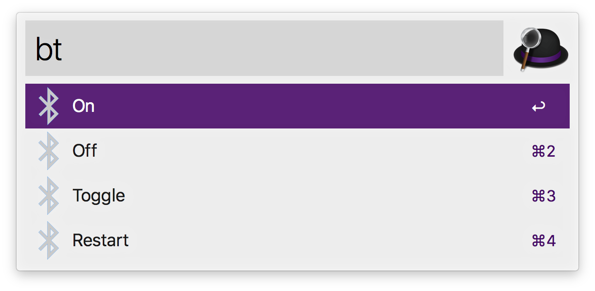

# Alfred Workflow - Bluetooth Control

Alfred Workflow to control Bluetooth. It can turn on, turn off, toggle and restart the Bluetooth radio.

## How to use

Intstall the workflow and type the `bt` keyword on Alfred followed by one of the commands, e.g. `bt restart`. The workflow will suggest the available actions based on the command and alias(es). A table of the available commands and alias(es) can be found below.

| Command   | Alias(es)             | Description                                                  |
| --------- | --------------------- | ------------------------------------------------------------ |
| `on`      | `activate`, `up`      | Turns on Bluetooth. If Bluetooth is already turned on, this command has no affect. |
| `off`     | `deactivate`,  `down` | Turns off Bluetooth. If Bluetooth is already turned off, this command has no affect. |
| `toggle`  | `change`, `switch`    | Toggles Bluetooth. If Bluetooth is tunred on, this command turns it off and vice versa. |
| `restart` | `reset`               | Restarts Bluetooth. If Bluetooth is turned off, this command just turns it it on. Otherwise this command turns Bluetooth off for a brief period of time before turning it back on. |

## Notes

- Once the workflow has been imported, feel free to change the default keyword if you don't like it.

