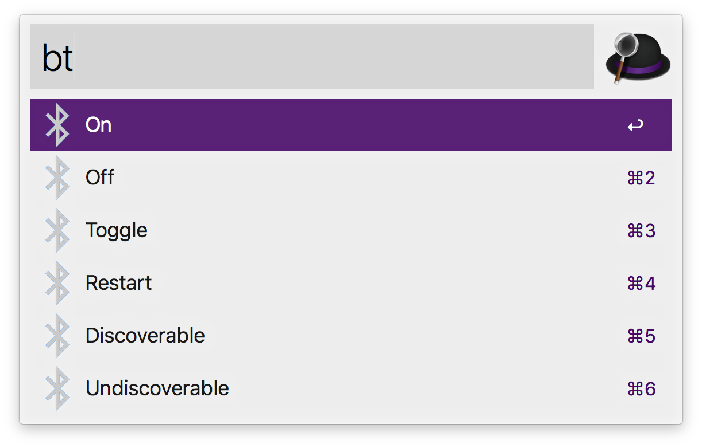

# Alfred Workflow - Bluetooth Control

Alfred Workflow to control Bluetooth. It can turn on, turn off, toggle and restart the Bluetooth radio and make Bluetooth discoverable and undiscoverable for other devices.

---

# ⚠ This project is no longer maintained here

This project is no longer maintained here. There are similar projects to this one, and I recommend using [tilmanginzel/alfred-bluetooth-workflow](https://github.com/tilmanginzel/alfred-bluetooth-workflow) as replacement.

---

## How to use

Intstall the workflow and type the `bt` keyword on Alfred followed by one of the commands, e.g. `bt restart`. The workflow will suggest the available actions based on the command and alias(es). A table of the available commands and alias(es) can be found below.

| Command          | Alias(es)          | Description                                                  |
| ---------------- | ------------------ | ------------------------------------------------------------ |
| `on`             | `activate`         | Turns on Bluetooth. If Bluetooth is already turned on, this command has no affect. |
| `off`            | `deactivate`       | Turns off Bluetooth. If Bluetooth is already turned off, this command has no affect. |
| `toggle`         | `change`, `switch` | Toggles Bluetooth. If Bluetooth is tunred on, this command turns it off and vice versa. |
| `restart`        | `reset`            | Restarts Bluetooth. If Bluetooth is turned off, this command just turns it it on. Otherwise this command turns Bluetooth off for a brief period of time before turning it back on. |
| `discoverable`   | `don`, `ond`       | Make Bluetooth discoverable for other devices. If Bluetooth is turned off, this command has effect when Bluetooth is turned on the next time. |
| `undiscoverable` | `doff`, `offd`     | Make Bluetooth undiscoverable for other devices.             |

## Notes

- Once the workflow has been imported, feel free to change the default keyword if you don't like it.

